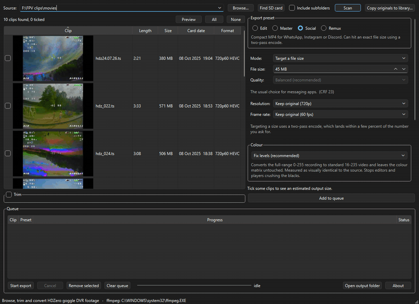
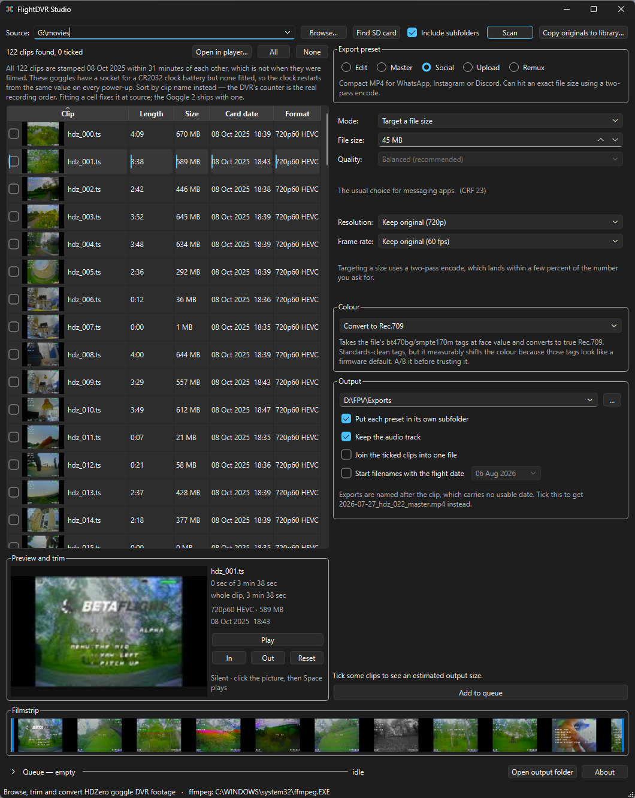
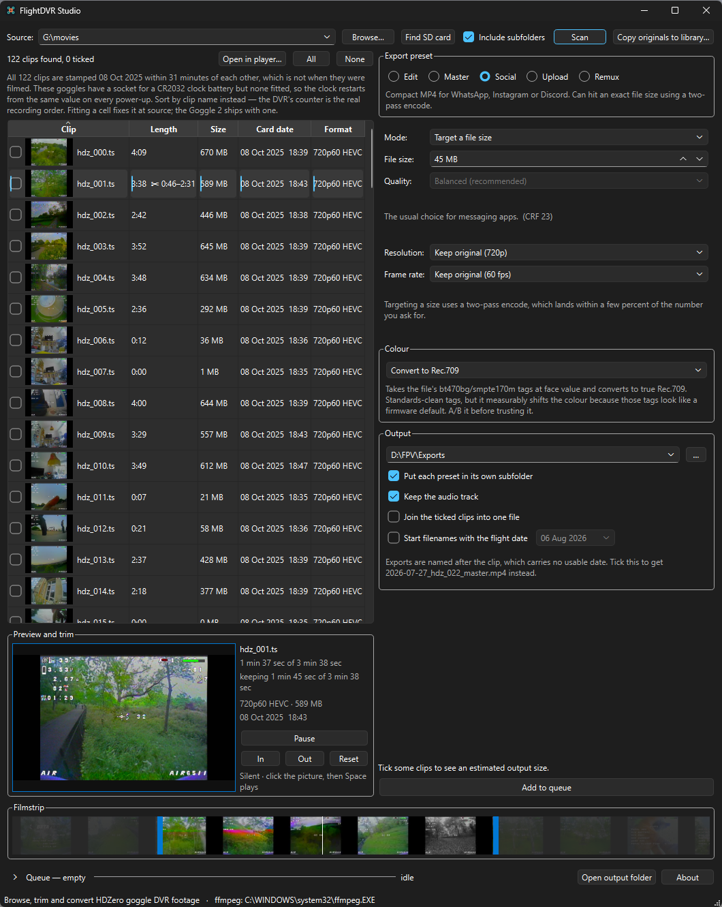
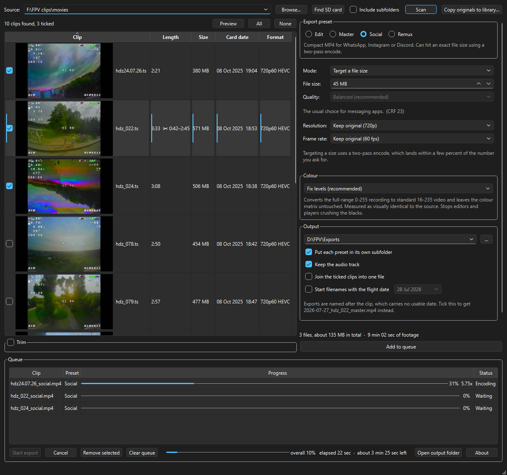

# FlightDVR Studio

*Browse, trim and convert HDZero goggle DVR footage.*

Pull a card out of your goggles and you have a folder of `.ts` files with names
like `hdz_047.ts`, no way to tell them apart, and a format most editors refuse to
open. FlightDVR Studio turns that into something you can use: browse the card
with thumbnails, preview and trim clips, then export them as an edit-ready
mezzanine, a high-quality MP4, or something small enough for WhatsApp.

It also fixes the colour problem these recordings have, which is the reason
footage converted with a plain ffmpeg command often comes out with crushed
blacks.



Free and open source under the GPL v3. Nothing is gated and there is no
account, no telemetry, and nothing to sign up for.

The one thing it does over the network is check whether a newer version exists:
a single request, at most once a day, to this project's own releases page on
GitHub. Nothing is sent beyond what any web request unavoidably reveals — an IP
address and the app's version — and nothing is downloaded or installed; a newer
release just shows a link. Untick **Check for updates** in the About box and no
request is made at all.

> Not affiliated with, endorsed by, or supported by HDZero. It is an independent
> tool that reads files their goggles produce.

---

## Installing

### Windows

Run **`FlightDVRStudio-Setup.exe`**. It installs per-user, so there is no
administrator prompt, and it puts ffmpeg inside the install folder — the machine
needs nothing else installed.

About 95 MB to download, 340 MB installed. Uninstalls from Add/Remove Programs.

Windows 10 or 11, 64-bit.

Windows will warn you that it "protected your PC", because the installer is not
code-signed. Click **More info**, then **Run anyway**. See
[troubleshooting](#troubleshooting) for why.

### Linux

Download **`FlightDVR_Studio-*.AppImage`**, make it executable, and run it:

```bash
chmod +x FlightDVR_Studio-*.AppImage
./FlightDVR_Studio-*.AppImage
```

About 63 MB. One file, nothing installed, delete it to uninstall. Built on
Ubuntu 22.04, so it runs on anything with glibc 2.35 or newer — which is every
current distribution, Bazzite and the other Fedora-based immutable ones
included.

Unlike the Windows build it does **not** carry its own ffmpeg, because your
distribution already ships a maintained one:

```bash
sudo apt install ffmpeg      # Debian, Ubuntu, Mint, Pop!_OS
sudo dnf install ffmpeg      # Fedora, Nobara
sudo pacman -S ffmpeg        # Arch, Manjaro
```

Image-based systems already include ffmpeg, so there is
nothing to do there. Run the app with `--check` if you want to confirm what it
found before you go looking.

Playback happens in the window and needs nothing else. Install VLC or mpv as
well if you want **Open in player…** to have somewhere to send a clip.

### macOS

Download **`FlightDVR-Studio-*-arm64.dmg`**, open it, and drag the app to
Applications. About 30 MB. Apple Silicon, macOS 11 or newer. Intel Macs are not
built for today — [ask](https://github.com/nkghxst/flightdvr-studio/issues) if
you need one and it is a small change to the build.

The app is not signed with an Apple Developer certificate, so the first launch
is refused. **Right-click the app and choose Open**, then confirm — you only
need to do this once. If macOS still refuses:

```bash
xattr -dr com.apple.quarantine "/Applications/FlightDVR Studio.app"
```

ffmpeg is not bundled here either. Install it with
[Homebrew](https://brew.sh):

```bash
brew install ffmpeg
```

### Verifying your download

Every release publishes the SHA-256 of each file, so you can confirm that what
you downloaded is what was built. None of these are code-signed, so this is the
only check that means anything.

```powershell
Get-FileHash FlightDVRStudio-1.4.0-Setup.exe -Algorithm SHA256
```

```bash
sha256sum FlightDVR_Studio-1.4.0-x86_64.AppImage    # Linux
shasum -a 256 FlightDVR-Studio-1.4.0-arm64.dmg      # macOS
```

**1.4.0**

| File | SHA-256 |
|---|---|
| `FlightDVRStudio-1.4.0-Setup.exe` | `a8b67589e472fb91f22846fba6b50d43fae43c209d2dd2fb5c11233fe04d6c9e` |
| `FlightDVR_Studio-1.4.0-x86_64.AppImage` | `5ce81819683fc70e3a5153e40c915033eb26ce9165545cdd66fbf8c62634e54c` |
| `FlightDVR-Studio-1.4.0-arm64.dmg` | `62f4828723f1b9ad62cee152bc3fc5c4fc6a72dad124246f58c848f7956f2fef` |

<details>
<summary>Earlier releases</summary>

**1.3.0** — no player in the window, so trimming means setting two numbers and
finding out afterwards. Joining trimmed clips with Remux writes a corrupt file
instead of refusing, and the low-space warning raises an error rather than
warning.

| File | SHA-256 |
|---|---|
| `FlightDVRStudio-1.3.0-Setup.exe` | `9c3de6763e383e4f3bd4eb1be85918683bcdd695bc353f75a4611c814a4845d0` |
| `FlightDVR_Studio-1.3.0-x86_64.AppImage` | `ad1fd20398fbba66ace8f88ac6518365ac8c0c0e4ab01d1d58b4ca255bc98600` |
| `FlightDVR-Studio-1.3.0-arm64.dmg` | `b883f2e83afc0bb96c386d8745197e7a41c3e16d8856a2b1711ba758aaeecc55` |

**1.2.0** — no Upload preset and no update check, so it never tells you a newer
version exists. Everything else works.

| File | SHA-256 |
|---|---|
| `FlightDVRStudio-1.2.0-Setup.exe` | `6f8d8c1b90a601b3bbb4bb10fbdb95f3efae4dc976fd673a52eba990abfdf7e5` |
| `FlightDVR_Studio-1.2.0-x86_64.AppImage` | `c432130ad29aae7c5172538a72e8a3bae4000c58496045d3a6aad7b9440616ab` |
| `FlightDVR-Studio-1.2.0-arm64.dmg` | `8eabb6c3230aa0c4599d4773d65759d513d7fb27a5c28f233a2c6bcf5a166928` |

**1.1.2** — joining clips into one file produced a result that was quietly
wrong. Everything else works.

| File | SHA-256 |
|---|---|
| `FlightDVRStudio-1.1.2-Setup.exe` | `a0262b6aa7809757e7f83b29da77deeacf8d1a81c056df6be1ea4a2a7cdd81ea` |
| `FlightDVR_Studio-1.1.2-x86_64.AppImage` | `3c34cc807709c32ec76f67e373731d29ff574dbae590b2ab0215a73ea373827c` |
| `FlightDVR-Studio-1.1.2-arm64.dmg` | `da548b3f9f1289943a7ec7b7bc8894a44c9994f6b8eee954f033c8bfb6fb1b31` |

**1.1.1** — fine on Windows and macOS, and on Linux with ffmpeg 5.1 or newer.
On older ffmpeg, which Ubuntu 22.04 and Debian 11 ship, exports fail and the
filmstrip is empty. 1.1.2 fixes that and changes nothing else.

| File | SHA-256 |
|---|---|
| `FlightDVRStudio-1.1.1-Setup.exe` | `f0ed2872217fa831c593ab052ffab7ac9b6205952609472368d6f49a3306e8e0` |
| `FlightDVR_Studio-1.1.1-x86_64.AppImage` | `0d53c8677cbd090c00b66e7c5c4a01329a79e0101e6d4da1036d5eb2e350134b` |
| `FlightDVR-Studio-1.1.1-arm64.dmg` | `77aeb1edba0f8fa173a479cba74d54d4da1d533802ab057a1581a15caf926035` |

**1.1.0** — superseded by 1.1.1, which fixes corrupt trimmed exports and a
failed export destroying the file it was replacing. Still downloadable, but
there is no reason to choose it.

| File | SHA-256 |
|---|---|
| `FlightDVRStudio-1.1.0-Setup.exe` | `228b5a4bd214be4a54143e7fd2d08b1281d480a735da508bba4f9211e148ebea` |
| `FlightDVR_Studio-1.1.0-x86_64.AppImage` | `8526a1cc19be7813a4b2b55b41a36cf14913cc95258e0ddf40761b493de3ffe4` |
| `FlightDVR-Studio-1.1.0-arm64.dmg` | `1d9f0493150406a36c9f330a215a5fa20471fc45a1248ce7dc8248e8b7aa30d3` |

**1.0.0** — Windows only.

| File | SHA-256 |
|---|---|
| `FlightDVRStudio-1.0.0-Setup.exe` | `02800a47b6d214d223988a35ffc8fba31e726c4291c872d525d0eeda479e1ce5` |

</details>

## Quick start

1. Put the goggle card in a reader and press **Find SD card**, or **Browse** to
   any folder of recordings.
2. Press **Scan**. Clips appear with thumbnails, length, size and format.
3. Tick the ones you want. Double-click any clip to watch it first.
4. Pick an export preset on the right.
5. **Add to queue**, then **Start export**.

That is the whole loop. Everything below is detail.

---

## The clip browser



Clips are listed with a thumbnail taken from a representative frame, plus
length, size, card date and format. Click any column heading to sort by it. The
default order is by clip name, which is the DVR's own counter and the only
reliable record of the order things were filmed in — see
[the clock problem](#the-goggles-cannot-keep-time).

Double-clicking a row plays it in the preview below the list. **Open in
player…** hands the highlighted clip to your usual video player instead, for
when you want a full screen or a scrubbing bar of your own. VLC or mpv is used
when either is installed, because Windows registers `.ts` to Media Player,
which opens the file and then often cannot decode the video inside.

Clips that already have an export for the current preset are marked
**✓ exported**, so on a full card you can see at a glance what is left to do.

Widening the window makes the thumbnails bigger rather than leaving an empty
filename column.

## Preview and trimming



Select a clip and it loads into the preview under the list, with its filmstrip
across the bottom of the window. **Play** runs it there — no other program, no
handing the file to something that cannot decode it.

Trimming sets where a clip starts and ends, mostly for cutting the minute or two
spent sitting on the bench before arming. Drag either handle on the filmstrip,
or press **I** and **O** while the clip plays to cut at the picture in front of
you. **Set in** / **Set out** do the same from the buttons, and **Reset**
restores the whole clip. The list then shows the range next to the length, and
the size estimate, progress and time remaining all follow the trimmed length.

For the exact cut, pause and use **,** / **.** to step through real source
frames (hold **Shift** for ten). The preview decodes only a small window around
the playhead, shows its exact timestamp and source frame number, and replaces
that window when you seek elsewhere rather than decoding the whole recording.

The preview is silent. Sound would need a second pipe and a second clock, and
DVR audio is motor whine — an in point is something you find by eye.

Playback decodes through ffmpeg rather than through Qt's video widget. On
Windows that widget uses Media Foundation, the same decoder behind Media
Player, which cannot handle HEVC inside an MPEG-TS — so it would work
perfectly on test footage and fail on every real recording.

Frames are pulled from the clip the first time you select it — a three minute
recording takes about four seconds, and is cached afterwards, so dragging is
instant rather than waiting on a seek.

Trims survive into a joined export: each clip keeps its own in and out points.
*Remux* is the exception and will say so — see below.

**Joining clips into one file** is the *Join the ticked clips into one file*
box, for when the DVR split a single flight across several recordings. Clips
are joined in DVR counter order rather than by timestamp, because
[the goggles cannot keep time](#the-goggles-cannot-keep-time).

Clips that do not match each other are fine. Different sizes, frame rates and
codecs are brought to a common format — the largest size and rate among them,
so nothing is thrown away to suit the smallest — and a clip with no sound gets
silence rather than removing the audio from the rest. Only *Remux* refuses a
mismatched set, because copying without re-encoding cannot change anything.

> **Remux is the exception.** It does no re-encoding, so it can only cut where a
> keyframe already is, and a trimmed rewrap may be a second or so out. Every
> other preset is frame-accurate.
>
> Joining *trimmed* clips with Remux is refused rather than done badly: the
> result plays and reports the right length while every join is torn. Reset the
> trims to join them untouched, or pick a re-encoding preset to keep them.

## Export presets

| Preset | Produces | Roughly | Use it for |
|---|---|---|---|
| **Edit** | DNxHR or ProRes in `.mov` | 58 GB/hour | DaVinci timelines, handing to an editor |
| **Master** | H.264 `.mp4`, quality-based | 11 GB/hour | archiving, sending to editors online |
| **Social** | H.264 `.mp4`, size-targeted | you choose | WhatsApp, Instagram, Discord |
| **Upload** | H.264 `.mp4` at 1080p or above | 20 GB/hour | YouTube, Instagram, Reddit |
| **Remux** | `.ts` → `.mp4`, no re-encode | same as source | instant lossless rewrap |

Sizes are for 720p60; other resolutions are scaled accordingly.

**Edit** exists because the free version of DaVinci Resolve on Windows cannot
decode H.265, so the original files cannot go on a timeline at all. Mezzanine
codecs are also intra-frame, so scrubbing is instant instead of stuttering.
DNxHR SQ, HQ and LB and ProRes 422 and LT are all available.

**Master** quality is chosen by name — Archive, High, Good, Compact — with the
underlying CRF number shown alongside. High is visually indistinguishable from
the original.

**Upload** is the only preset that will make the picture *bigger*, and it is
worth being clear about why, because upscaling usually deserves suspicion. It
does not recover detail the goggles never recorded — nothing can. What it does
is arrive at a site in a higher resolution tier. YouTube, Instagram and Reddit
re-encode everything they receive and decide how much bitrate to spend based on
the resolution you sent, so a 1080p upload gets a bigger allowance than a 720p
one and more of your footage survives their encode. The picture going in is the
same; the difference is how kindly the platform treats it.

It is quality-based and never size-targeted. Spreading a fixed byte budget over
2.25 times as many pixels is worse than doing neither, so that combination is
not offered.

**Social** hits an exact file size using a two-pass encode, landing within about
one percent of the number you ask for. It can also downscale and halve the frame
rate. Only sizes smaller than the source are offered, so it never upscales.

**Keep the audio track** can be turned off on any preset. DVR audio is mostly
motor noise and wind, and dropping it buys bitrate on a size-targeted export.

### Hardware encoding

If your machine has a usable hardware encoder, a checkbox offers it and names
which one — NVIDIA NVENC, Intel Quick Sync, AMD AMF or Apple VideoToolbox. It is
roughly three times faster and slightly larger for the same quality.

Availability is decided by *running* a test encode at startup, not by asking
ffmpeg what it supports. A build can advertise three encoders on a machine that
has none of the hardware.

## Copying originals off the card

**Copy originals to library** copies the untouched `.ts` files into folders named
after the flight date, verifying each copy and skipping anything already there.
Nothing is converted, and nothing is deleted from the card — clearing it is left
to you deliberately.

## The queue



Rows show the filename that will be **written**, so the effect of your settings
is visible before anything starts. Changing an output setting re-targets jobs
that have not begun yet; jobs already running or finished are left alone.

**Remove selected** drops rows and **Clear queue** empties it. Neither touches a
job that is currently encoding — cancel that instead. Double-clicking a finished
row opens what it produced.

Below the queue is an overall progress bar with elapsed and estimated remaining
time, weighted by footage length rather than job count.

### What it will not do quietly

- **Overwrite.** If an export would replace a file that already exists, it says
  which ones and offers to skip them, overwrite, or stop.
- **Fill the disk.** Exports are estimated and checked against free space first.
  A full card at Edit quality runs to several hundred gigabytes.
- **Leave a broken file behind.** A cancelled encode produces an unplayable MP4
  named exactly like a finished one. That file is deleted. Files that were
  already there before the job started are never touched.
- **Queue the same output twice**, or re-encode work that has already finished.

## Keyboard shortcuts

| Key | Does |
|---|---|
| `F5` | Scan the current source |
| `Ctrl` `A` | Tick every clip |
| `Ctrl` `Shift` `A` | Untick every clip |
| `Ctrl` `P` | Play the highlighted clip in the preview |
| `Ctrl` `Shift` `P` | Open it in your usual video player instead |
| `Ctrl` `Enter` | Add ticked clips to the queue |
| `F9` | Start the export |
| `Delete` | Remove the selected rows from the queue |
| `Space` | Tick or untick the highlighted clip |
| Double-click | A clip plays it in the preview; a finished queue row opens the result |

With the preview picture focused — click it, or press `Ctrl` `P` — these apply
instead, and `Space` plays rather than ticking:

| Key | Does |
|---|---|
| `Space` or `K` | Play or pause |
| `I` / `O` | Set the in / out point at the playhead |
| `,` / `.` | Previous / next source frame |
| `Shift` `,` / `Shift` `.` | Move ten source frames |
| `←` `→` | Move a second |
| `Shift` `←` `→` | Move five seconds |
| `Home` / `End` | Jump to the in / out point |
| `Esc` | Stop |

---

## Which goggles it works with

All HDZero goggles write the same MPEG-TS format to `movies/` on the card, so
anything producing `hdz_NNN.ts` should work. They do not all record at the same
*size* — the Box Pro does 720p60, other modes do 720p90 and 1080p30, and the
Goggle 2 goes to 1080p.

Nothing in the app assumes a resolution or frame rate. Downscale and frame rate
options are built from the clips you have selected, and size estimates scale
with the real pixel rate:

| Footage | DNxHR SQ |
|---|---:|
| 720p60 | 58 GB/hour |
| 720p90 | 88 GB/hour |
| 1080p30 | 66 GB/hour |
| 1080p60 | 132 GB/hour |

## Two things worth knowing about HDZero footage

### The colour is tagged oddly, and that matters

These recordings store **full-range** video — the luma spans 0–255, where normal
video occupies 16–235. Anything assuming the usual range, which is most players
and every editor, clips the blacks and the highlights. That is why footage run
through a plain ffmpeg command often looks crushed.

They are also tagged `bt470bg` primaries and `smpte170m` transfer, which is PAL
standard definition — not something a 720p digital camera has any business
claiming. It looks like a firmware default.

The obvious response is to convert everything to Rec.709 and tag it properly.
That turns out to make things worse. Four approaches were encoded losslessly,
rendered to RGB and compared against the source frame by frame:

| Approach | Difference from source | Worst pixel error |
|---|---:|---:|
| Leave the colour alone | none | 0 |
| **Fix the range only** (default) | **imperceptible** | **3** |
| Retag the matrix as bt709 | visible | 75 |
| Full Rec.709 conversion | worst | 108 |

A colour conversion is only as trustworthy as the tags it reads, and these tags
are not trustworthy. So the default corrects the range — the one thing that is
provably wrong — and leaves everything else alone.

All three modes are available if you disagree, and you can reproduce the
comparison on your own footage:

```bash
python tools/compare_colour.py "E:\movies\hdz_001.ts"
```

### The goggles cannot keep time

Every clip on a card tends to carry the same date, minutes apart, whatever day
it was actually filmed. That is not a fault in the card or this app. The goggle
firmware reports:

```
rtc_init has NOT detected a battery
```

There is a socket for a **CR2032** on the board but no cell fitted, so the clock
restarts from the same stored value on every power-up.

**This is fixable in hardware.** Fitting a CR2032 gives you real timestamps from
then on. The Goggle 1 ships without a cell; the Goggle 2 ships with one.

For footage already recorded, nothing can recover the true date, so the app:

- labels the column **Card date**, not "Recorded", and says why on hover
- shows a note above the list when the timestamps are obviously clustered, which
  stays hidden on goggles whose clock works
- asks for the flight date when copying originals to the library
- can start exported filenames with that date, set in the Output box

Sort by clip name for true recording order — the DVR's counter is reliable even
when its clock is not.

## Troubleshooting

**"Windows protected your PC" when you run the installer.** Expected. The
installer is not code-signed — a certificate costs several hundred pounds a
year, which is hard to justify for something given away. Click **More info**,
then **Run anyway**. If you would rather verify it first, the SHA-256 of each
release is published on its release page.

**Your antivirus flags it.** Occasionally happens to anything built with
PyInstaller, which looks structurally like a self-extracting archive. It is a
false positive; report it to your vendor if you like, and check the SHA-256
against the release page.

**"macOS cannot verify that this app is free from malware."** Expected, for the
same reason — signing needs a paid Apple Developer account. Right-click the app
and choose **Open** rather than double-clicking it, then confirm. If that does
not work, clear the quarantine flag:

```bash
xattr -dr com.apple.quarantine "/Applications/FlightDVR Studio.app"
```

**"Could not find ffmpeg" at startup.** On Linux and macOS the app uses your
system ffmpeg, so install it — see [Installing](#installing) for the command.
On Windows this only happens when running from source; the installed build
carries its own copy.

If you have installed it and the app still cannot see it, ask the app what it
found:

```bash
./FlightDVR_Studio-*.AppImage --check
```

```bash
"/Applications/FlightDVR Studio.app/Contents/MacOS/FlightDVRStudio" --check
```

That prints the version, the Qt platform in use and the exact ffmpeg paths it
resolved, then exits. It is the quickest thing to paste into a bug report.

**A clip will not preview.** Windows maps `.ts` to Media Player, which usually
cannot decode the video inside; macOS hands it to QuickTime, which cannot
either. Install VLC, mpv or IINA and it will be used automatically. On Linux
any of VLC, mpv, mplayer or totem is picked up, including Flatpak versions.
Alternatively the Remux preset rewraps a clip to `.mp4` in seconds without
re-encoding.

**DaVinci Resolve will not import the files.** The free version on Windows
cannot decode H.265. Use the **Edit** preset, which produces a mezzanine it can
read. Remux will not help — it keeps the original video.

**Exports look washed out or crushed.** Check the Colour setting is on *Fix
levels*. If you have built a grade around untouched footage, use *Leave colour
alone* instead.

**Every clip has the same date.** Expected — see
[above](#the-goggles-cannot-keep-time).

---

## Building from source

```bash
pip install -r requirements.txt
python -m flightdvr
```

Running from source needs ffmpeg and ffprobe on PATH, or unpacked into
`C:\ffmpeg\bin`.

```bash
python -m pytest tests/ -q          # no ffmpeg required
```

Each platform has its own packaging script. All three run the tests, regenerate
the icon, build the bundle and prove the result starts before packaging it.

| Platform | Command | Produces | Also needs |
|---|---|---|---|
| Windows | `pwsh packaging\build.ps1` | per-user installer | Inno Setup 6 (`winget install JRSoftware.InnoSetup`) |
| Linux | `packaging/build-appimage.sh` | AppImage | `curl`; appimagetool is fetched and cached |
| macOS | `packaging/build-macos.sh` | signed-ad-hoc `.app` in a `.dmg` | Xcode command line tools |

Linux and macOS builds are produced by
[GitHub Actions](.github/workflows/build.yml) on every push, so you do not need
those machines to release for them. The Windows installer is still built by
hand — see the note at the top of that workflow for why.

There is more detail on the internals, the measured findings behind the colour
handling, and the traps in this footage in
[docs/DEVELOPMENT.md](docs/DEVELOPMENT.md).

Where this is going next — and what it deliberately will not do — is in
[docs/ROADMAP.md](docs/ROADMAP.md).

### How it is put together

| File | Contains |
|---|---|
| `media.py` | ffmpeg discovery, clip probing, hardware detection |
| `presets.py` | colour modes, presets, ffmpeg command construction |
| `jobs.py` | the export queue and progress parsing |
| `scan.py` | drive detection, clip scanning, copying off the card |
| `thumbs.py` | cached thumbnail extraction |
| `trim.py` | filmstrip extraction and the scrubbing bar |
| `ui.py` | the window |

A few decisions that are not obvious from the code:

- **ffmpeg runs as a child process**, never linked. The app looks inside its own
  bundle before it looks at PATH, so a packaged copy always uses its own
  known-good pair rather than whatever is installed.
- **Scanning uses ffprobe's default probe size.** Forcing a large one costs
  about eight times as much reading from a card over USB and returns identical
  information on these files. The expensive settings remain as a fallback.
- **Thumbnails and filmstrips decode past the seek point.** Seeking into an
  MPEG-TS lands on an estimated byte offset rather than a keyframe, so frames
  taken straight after a seek are torn or grey.
- **Filmstrips decode keyframes only**, which is five times quicker than a full
  decode for finer granularity than anyone needs.
- **Two-pass encoding keeps audio in both passes.** The usual advice to pass
  `-an` on the first pass shifts the video framing by one frame here, and x264
  then rejects the stats file.
- **Exports run one at a time.** ffmpeg already uses every core.

---

## Licensing

FlightDVR Studio is **GPL v3** — see [LICENSE](LICENSE).

Matching the licence of the bundled ffmpeg is deliberate. It removes any
question about whether the app and the binary form a combined work, which is the
one genuinely murky part of shipping ffmpeg inside an installer.

Only the Windows installer bundles ffmpeg. The AppImage and the macOS app use
whatever your package manager installed, so they redistribute no ffmpeg binary
and carry no obligation for its source.

The bundled Windows build is `7.1.1-full_build-www.gyan.dev`, configured
`--enable-gpl --enable-version3`. It is **not** an `--enable-nonfree` build,
which could not be redistributed at all.
[THIRD-PARTY-NOTICES.md](THIRD-PARTY-NOTICES.md) records the version, origin and
licence, along with a written offer for the corresponding source as required by
section 6 of the GPL.

Qt is used via PySide6 under the **LGPL v3**, dynamically linked and unmodified.

**H.264 and H.265 are patent-encumbered** in some jurisdictions. This software is
provided free of charge and makes no patent grant. If you redistribute it or use
it commercially, satisfy yourself about the position where you are.
