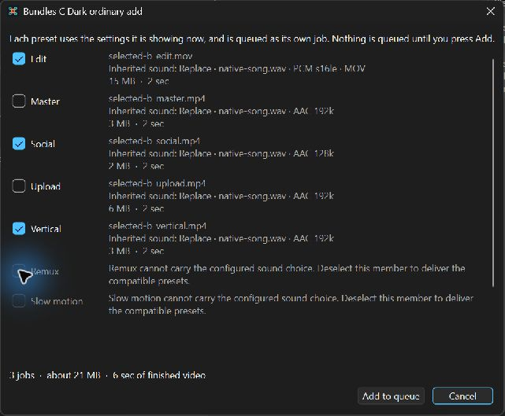

# FlightDVR Studio 2.0 user guide

> **2.0.0 is an unreleased release candidate.** This guide describes the
> current development version, which has not been published as a download yet.
> The latest published release is 1.5.0; Flow, Music, the Assembly, bundles,
> Vertical, Slow motion, stills and naming templates all came after it. Final
> download names, sizes and hashes will come from the published release.

## From card to finished video

FlightDVR Studio helps you review goggle recordings, keep the useful ranges, arrange a sequence and make files for editing or sharing. Your session records decisions; it does not contain copies of your recordings or music.

Start with **Find SD card** or **Browse**, then **Scan**. Select a recording to inspect it. Tick the recordings or ranges you intend to export. A highlighted recording, a ticked recording and the output you are editing serve different purposes: check the output's name before changing its settings or adding it to the queue.

Mark recordings **Unreviewed**, **Keep**, **Maybe** or **Reject** as you work. Length and review filters narrow the visible list. Hiding a ticked recording does not untick it: hidden selections can still be included in a batch.

## Choose your workspace

Use **View → View: Classic** for the familiar browser, preview and output controls together. **View → View: Flow** organises the same session into **Browse, Trim, Assemble, Music, Output and Queue**. Switching views is a change of workspace, not a separate project.

In Flow, select the planned output you want to work on. Its settings and music belong to that output. **Queue this output** submits that selection; **Queue all planned** submits the planned set, each with its own choices. If no output is selected, choose one before using the selected-output action.

## Know what you are looking at

| What is shown | What it means |
|---|---|
| Source recording | The recording you are browsing or trimming. Its clock refers to the source. |
| Selected output picture | A preview of the selected output's supported picture treatment and output clock. It is not an encoded file. Read any capability warning beside it. |
| Assembly preview | The ordered ranges on the joined output clock, including repeated entries. |
| Submitted settings | A read-only record of what a queued job captured. Later changes to the working plan do not edit it. |
| Completed file | The actual result on disk. Open this to judge delivery, especially Slow speed or Remux cut boundaries. |

Source focus can differ from the selected output. Follow the **Output** or **For:** identity and the picture caption; do not assume the highlighted source row determines every page. Source trim controls are unavailable beside a bound output picture: go to **Trim** to change source ranges.

## Keep a range or build an Assembly

Set the in and out points on the filmstrip, or use **I** and **O** with the preview focused. Pause and step through frames for the cut. **Add range** keeps another part of the same recording; name ranges so their purpose is recognisable later. **Grab still…** saves the paused decoded frame as a full-resolution PNG through its save dialog.

For one joined file, build the **Assembly** from the ranges you want and put its rows in the intended order. **Use ticked ranges** fills it from the current ticks. **Default order** rebuilds from those ticks; it is not just a sort of the existing rows. Check the visible sequence before using it. An Assembly can retain repeated material; the order in this list is the delivery order, rather than the goggle clock.

Inspect or seek through the joined output, including the joins. Music for an Assembly follows the finished output rather than starting over for each source recording. A preview is still distinct from the eventual file; open a completed export as the last delivery check.

## Choose the sound for this output

Select the intended output, then open **Music**. The sound modes describe the exported file:

| Mode | Result |
|---|---|
| **Original audio** | Keep the recording's own sound where present. |
| **No sound** | Write no audio track. |
| **Replace with music** | Use your chosen music instead of the recording's sound. |
| **Mix music with original** | Combine the chosen music and recording sound; adjust their levels separately. |

Choose a track and wait for it to be read. The **Music time** lane represents the song; its passage handles choose the section you want. The **Output time** lane shows how that choice occupies the finished output. Read the passage times as you move the handles. For precise values, use the numeric controls, including **More…** in compact layouts. Finish a typed edit with Enter, Tab or by leaving the field; for example, type `0.5` into Fade in and commit it.

If the selected passage is shorter than the output, choose **Loop** to repeat that passage or **Play once** to let the music end. In Mix mode the recording sound can continue after the music ends. Fade requests belong to the output; if their combined length exceeds it, the applied fades are shortened to fit while your requested values are retained.

Use **Listen** and the available listening controls to audition the intended sound. Monitoring volume changes what you hear while working; use the music and recording level controls to change the export. Check the listening status rather than assuming sound is active. After changing a selected range or Assembly order, follow the prompt to press Play or Listen again.

Configured sound is supported for **Master, Edit, Social, Upload and Vertical**, including compatible Assemblies and bundle members. **Remux** does not apply configured sound and **Slow motion** exports silently. An unsupported choice is explained rather than silently removed. Edit uses PCM audio in its MOV output; the supported MP4 routes use AAC, with Social using 128 kbit/s when it carries audio.

## Choose a delivery

| Preset | Use it for |
|---|---|
| **Edit** | An edit-ready MOV mezzanine, with PCM for configured audio. |
| **Master** | A high-quality MP4 to keep. |
| **Social** | A compact MP4, using a size target or a quality choice. |
| **Upload** | An upload-oriented MP4. |
| **Vertical** | A portrait delivery with a crop position you choose. Check the output picture and any source-size refusal. |
| **Remux** | Rewrapping compatible streams without re-encoding. Cut boundaries are constrained by keyframes; inspect the finished file rather than treating the intended interval as a frame-accurate promise. |
| **Slow motion** | A silent slowed export using the source frames. Judge timed speed in the completed file; smooth timed Slow preview is not promised. |

Social **size** mode budgets for the audio the output actually carries. CPU encoding uses two passes to approach the requested size. Hardware size targeting uses one pass and is less precise. **Quality** mode chooses quality rather than guaranteeing a file size. Read the displayed explanation and expected name before queueing; an estimate is not a byte-exact promise.

For several deliveries of the same material, open the bundle confirmation and choose its preset members. Each member keeps its own preset settings but inherits the selected target's sound choice. There is no separate music editor for each bundle member. Deselect an incompatible member explicitly; it is not silently dropped. Check names and refusals, then press **Add to queue**. **Cancel** adds nothing.

*A development capture on Windows using synthetic example media, taken before 2.0.0 was named; the bundle confirmation's code has not changed since. Edit, Social and Vertical inherit the selected output's sound choice (Replace); Remux and Slow motion explain why they cannot carry it. The names and sizes are this example's values, not release defaults.*

Bundling adds separate jobs to the queue. It is not an all-or-nothing export transaction: if a later member fails, already completed files are kept. Inspect a queued job through **View settings** to see its captured, read-only choices.

## Work in a smaller window

Classic's **Collapsed**, **Normal** and **Expanded** list modes change the space given to the browser. **Show clips** returns from its summary. When Music and a complete browser row cannot fit together, Classic can temporarily fold the list and retain a selected-recording summary. Use its visible restore control or close Music to recover the space.

Flow keeps the visual music lanes usable in its compact arrangement, with additional numbers behind **More…**. Keep the preset explanation, name and any refusal in view while deciding what to queue. If a layout becomes awkward, **View → Restore default layout** is the recovery action. Layout folding is not a reason to assume selections have been cleared. Which compact window sizes are supported has not been settled for 2.0.0, so this is not a promise that every smaller window works.

## Save, reopen and finish

Use **Session → Save session as…** for a named session and **Open session…** or **Recent sessions** to return to it. Keep the source recordings and external music available. A session references them rather than embedding them; recordings are matched using path, size and modification time, not filename alone. Missing or changed music needs attention before its waveform, audition or export can be trusted; reselect the intended file rather than assuming a same-named replacement is equivalent.

Review the planned outputs after reopening, then inspect submitted settings separately. Queueing captures a decision; editing a plan afterwards does not change an already submitted job. Check its destination and status, start export, and open the completed file when it finishes.

On Windows, cancelling during the final sound check can occasionally leave the job's unfinished temporary output. It is a known limitation under investigation, not a completed file or a fixed defect. Follow the exact path reported by the app and the guidance in [Known issues](KNOWN_ISSUES.md); do not delete a folder of similar files.

## Platform and preview limits

Colour conversion that needs **zscale** depends on the actual FFmpeg build. Do not treat a missing-filter warning as a successful conversion or assume every installed macOS FFmpeg supports that path. Use a supported choice deliberately; no universal filter-support claim is made here.

The 2.0.0 Linux AppImage is built to carry its own pinned FFmpeg and FFprobe, as the Windows installer already does, so it needs no separately installed FFmpeg. The published 1.5.0 AppImage does not carry them. The README's [installation notes](../README.md#installing) describe the 2.0.0 packages; final download names, hashes and sizes will come from the published release. No release date is given here.
